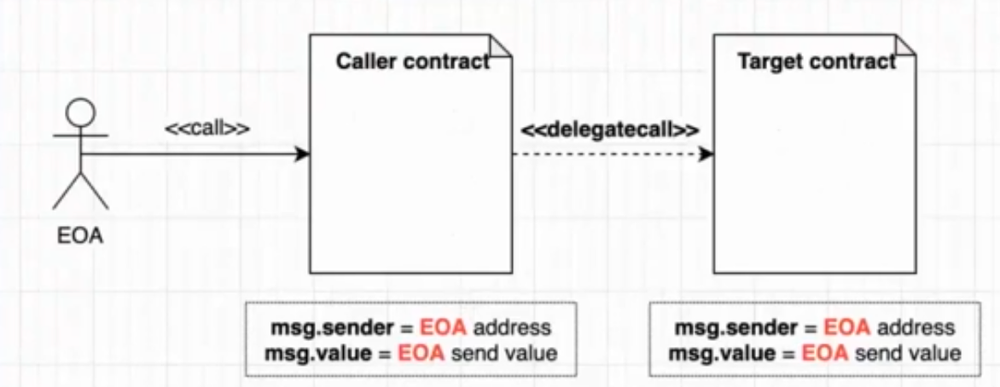
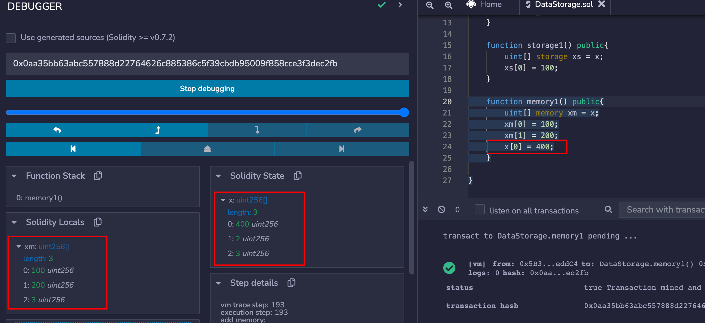
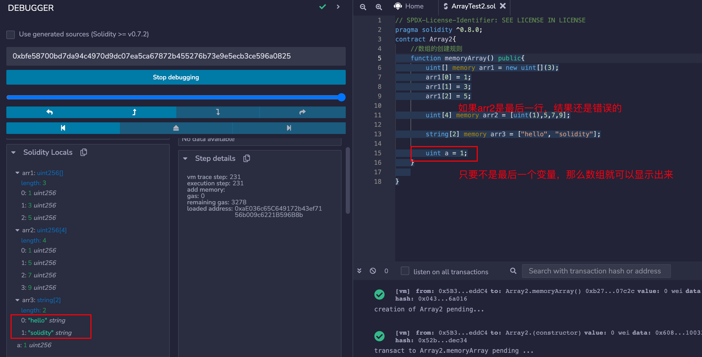

# solidity

## 基础语法

###  pragma

版本标识指令。用来启动某些编译器检查。比如pragma solidity ^0.8.0;表示当前合约只可以被主版本是0.8的编译器进行编译。又比如pragma solidity >= 0.7.0 < 0.9.0;表示当前合约可以被主版本大于等于0.7，小于0.9的编译器进行编译。

###  值类型

#### bool

布尔类型。取值是true或者false

#### int/uint

表示无符号或者有符号的整数类型。uint8~uint256以及int8~int256。以8位步长递增。uint、int分别代表的是uinit256以及int256。下面的案例就是越界了。

```solidity

// SPDX-License-Identifier: SEE LICENSE IN LICENSE
pragma solidity ^0.8.0;
contract OverFlow{
    function add1() public pure returns (uint8){
        uint8 x = 127;
        uint8 y = x * 2;
        return y;
    }

    function add2() public pure returns (uint8){
        uint8 x = 240;
        uint8 y = 16;
        uint8 z = x + y;
    }
}
```

#### address

地址类型来表示一个账号，地址类型有两种。address：一个20个字节的值。address payable:表示可支付地址，与address相同也是20字节。不过有其自身的成员函数transfer和send。**transfer执行失败会出异常，但是send执行失败会返回false，不会出异常。**

> \<address>.balance(uint256)   以Wei为单位的地址类型的余额
>
> \<address payable>.transfer(uint256 amount) 向地址类型address发送amount数量的Wei，失败时抛出异常。
>
> \<address payable>.send(uint256 amount) returns (bool) 向地址address发送amount数量的Wei，失败时返回false。

```solidity
// SPDX-License-Identifier: SEE LICENSE IN LICENSE
pragma solidity ^0.8.0;
contract TestAddress{
    function testTransfer(address payable x) public{
        //任何一个合约都可以显式的转换成address类型
        address myaddress = address(this);
        if(myaddress.balance >= 10){
            //如果x是一个合约地址，那么当transfer发生时，合约的receive或者fallback函数会随着transfer一起调用
            x.transfer(10);
        }
    }
}
```

如下代码所示，每new一次合约，便会创建一个新的合约。

```solidity
// SPDX-License-Identifier: SEE LICENSE IN LICENSE
pragma solidity ^0.8.0;
contract A{

    function callMethod() public returns (uint){
        //这里发生了什么？为什么会获取不到结果？
        //每调用一次new，那么链上肯定会生成一个新的合约，在internal txns中可以看到
        B b = new B();
        return b.say();
    }
}

contract B{

    function say() public pure returns (uint){
        return 10;
    }
}
```


如果希望调用B合约的say方法，可以使用如下方式来进行：

```solidity
// SPDX-License-Identifier: SEE LICENSE IN LICENSE
pragma solidity ^0.8.0;
contract A{

    function callMethod(B b) public returns (uint){
        return b.say();
    }
}


contract B{

    function say() public pure returns (uint){
        return 10;
    }
}
```

地址类型还有几个比较偏向于底层的成员变量，类似于java的反射。这部分没有理解，后续需要进一步学习。

> call
>
> Delegatecall
>
> Staticcall

下面这个案例其实就是transfer和call之间的区别。

transfer在进行转账时，可能会失败，因为gas问题

而使用call没有这个问题

```solidity
// SPDX-License-Identifier: SEE LICENSE IN LICENSE
pragma solidity ^0.8.0;

contract Address1{

    uint total;

    event logdata(uint x);

    receive() external payable{
        emit logdata(msg.value);
        total += msg.value;
    }

    function getBalance() public view returns (uint){
        return address(this).balance;
    }
}

contract Call1{

    //address owner;

    constructor() payable{
        //owner = msg.sender;
        //这行代码可以在部署时，由外部合约控制账号给合约初始化一定的ether
        msg.value;
    }

    //至于如何在合约中存储合约控制者的外部账号，暂不清楚
    // function getOwner() public returns (address){
    //     return owner;
    // }

    //这个方法再当前合约给其他地址进行转账时，会失败，因为该方法的固定的gas设置为2300
    //而调用transfer方法时，接收地址会调用receive或者fallback方法等，这些也需要gas
    function transferEther(address toAddress) public returns (bool){
        payable(toAddress).transfer(0.01 ether);
        return true;
    }

    function transferEtherViaCall(address toAddress) public{
        (bool success, ) = toAddress.call{value: 0.01 ether}("");
        require(success, "transfer ether failed");
    }

    // function transfertoContract() payable public{
    //     payable(address(this)).transfer(10 ether);
    // }
}
```

call和delegatecall之间的区别

**call会切换上下文，但是delegatecall不会**




```solidity
// SPDX-License-Identifier: SEE LICENSE IN LICENSE
pragma solidity ^0.8.0;
//合约被调用者
contract Called{
    uint public number;
    address public sender;

    function setN(uint n) public{
        number = n;
        sender = msg.sender;
    }

    event logdata(uint x);

    receive() external payable{
        emit logdata(msg.value);
    }

    fallback() external{}

    function getBalance() public view returns (uint){
        return address(this).balance;
    }
}

//合约调用者 注意：caller和called合约调用者和被调用者的变量名称应该完全一致
contract Caller{
    uint public number;
    address public sender;

    function delegateCallN(address e, uint n) public{
        bytes memory methodData = abi.encodeWithSignature("setN(uint256)", n);
        e.delegatecall(methodData);
    }

    function callN(address e, uint n) public{
        bytes memory methodData = abi.encodeWithSignature("setN(uint256)", n);
        //不晓得为啥加上gas设置之后，就没法调用了;原因是gas不足，无法调用
        e.call{gas:300000}(methodData);
        //e.call(methodData);
    }
}
```

Caller是合约的调用者；Called是合约的被调用者

在Caller中我们定义了两个方法，一个是call方法，一个是delegatecall方法。


**如果函数的运行导致变量值发生修改，那么改变的也是最终被调用者Called身上。**


**如果函数的运行导致变量值发生修改，那么改变的是Caller合约调用者里面的变量。**


### 引用类型

值类型在赋值存储时总是完整存储完整的拷贝。而对于一些复杂的数据类型占用的空间会比较大，开销会很大。因此就可以使用引用的方式。通过不同的名称的变量指向同一个值。引用类型有数组、结构体、映射。

####  引用类型的存储位置 

引用类型都有一个额外的属性来标识数据的存储位置（使用引用类型必须明确地提供存储该类型的数据位置）：

**memory**：内存。生命周期只存在于函数调用期间(生存期位于function()函数内，超过作用域失效)。

**storage**：存储。状态变量保存的位置。开销最大(生存期同contract一致，状态变量强制为storage)。

**calldata**：调用数据。用于函数参数不可变存储区域(存储在内存中，不上链。但是和memory不同的是calldata变量不可以修改，类似于final、immutable等，一般用于函数的参数，calldata一般更多用在参数上面，可以节省gas费用。如果使用memory类型，那么 需要再将引用类型完整的复制一遍，而calldata不需要)。

```solidity
function callData1(uint[] calldata _x) public pure returns (uint[] calldata) {
        //calldata类型的变量不可以被修改
        //calldata arrays are read-only
        //_x[0] = 1;
        return _x;
    }
```

```solidity
// SPDX-License-Identifier: SEE LICENSE IN LICENSE
pragma solidity ^0.8.0;
contract StorageTest {
    //状态变量的存储位置是storage
    string public text;

    //参数的变量一般设置为calldata类型；external表示是对于智能合约外部是可见的，但是内部无法调用
    function set(string calldata _text) external{
        text = _text;
    }

    //view表示和智能合约交互只有查询操作；pure表示既不存储，也不修改
    function get() external view returns (string memory){
        return text;
    }
}
```


#### 不同存储位置赋值规则

不同存储类型的数据在进行相互赋值时，有时候会产生独立的副本（也就是修改新变量的值不会影响原先变量的值），有时候会产生相互引用（修改新变量会影响原先变量的值）

**合约的状态变量(storage)赋值给本地函数里的storage时，会创建引用，改变新变量会影响原先变量。**

```solidity
// SPDX-License-Identifier: SEE LICENSE IN LICENSE
pragma solidity ^0.8.0;

contract DataStorage {

    uint[] x  = [1,2,3];
    
    function callData1(uint[] calldata _x) public pure returns (uint[] calldata) {
        //calldata类型的变量不可以被修改
        //calldata arrays are read-only
        //_x[0] = 1;
        return _x;
    }

    function storage1() public{
        uint[] storage xs = x;
        xs[0] = 100;
    }
}
```


**合约的状态变量(storage)赋值给memory，会创建独立的副本，修改其中一个不会对另外一个产生影响。**

```solidity
// SPDX-License-Identifier: SEE LICENSE IN LICENSE
pragma solidity ^0.8.0;

contract DataStorage {

    uint[] x  = [1,2,3];
    
    function callData1(uint[] calldata _x) public pure returns (uint[] calldata) {
        //calldata类型的变量不可以被修改
        //calldata arrays are read-only
        //_x[0] = 1;
        return _x;
    }

    function storage1() public{
        uint[] storage xs = x;
        xs[0] = 100;
    }

    function memory1() public{
        uint[] memory xm = x;
        xm[0] = 100;
        xm[1] = 200;
        x[0] = 400;
    }

}
```



**memory赋值给memory，会创建引用。改变新变量时会修改原变量的值**。

```solidity
// SPDX-License-Identifier: SEE LICENSE IN LICENSE
pragma solidity ^0.8.0;

contract DataStorage {


    uint[] x  = [1,2,3];
    
    function callData1(uint[] calldata _x) public pure returns (uint[] calldata) {
        //calldata类型的变量不可以被修改
        //calldata arrays are read-only
        //_x[0] = 1;
        return _x;
    }

    function storage1() public{
        uint[] storage xs = x;
        xs[0] = 100;
    }

    function memory1() public{
        //storage赋值给memory
        uint[] memory xm = x;
        xm[0] = 100;
        xm[1] = 200;
        x[0] = 400;
    }

    function memory2() public{
        //memory类型的变量赋值给memory，会创建引用，修改一个，另外一个也会随之修改
        //创建memory的数组，需要使用如下方式
        //但是目前依然有困惑：为什么不可以使用uint[] memory xm1 = [1,2,3,4]...
        //原因在于声明数组时必须指定数组的长度。uint[4] memory xm1 = [1,2,3,4]
        uint[] memory xm1 = new uint[](7);
        xm1[0] = 1;
        xm1[1] = 2;
        xm1[2] = 3;
        xm1[3] = 4;
        xm1[4] = 4;
        xm1[5] = 5;
        xm1[6] = 6;
        uint[] memory xm2 = xm1;
        xm2[0] = 7;
    }
}
```


#### 不同变量的作用域

##### 状态变量

**状态变量**：数据会存储在链上，gas消耗比较大 。类似于其他编程语言的成员变量。

```solidity
// SPDX-License-Identifier: SEE LICENSE IN LICENSE
pragma solidity ^0.8.0;

contract DataStorage {
		//状态变量
    uint[] x  = [1,2,3];

    function storage1() public{
        uint[] storage xs = x;
        xs[0] = 100;
    }


```

##### 局部变量

**局部变量**：仅在函数执行过程中有效。函数退出之后，变量无效。局部变量仅存储在内存中，不上链，gas消耗低。上图的函数内部。

##### 全局变量

**全局变量**：可以在全局内使用的变量。无需进行声明。

> `blockhash(uint blockNumber) returns (bytes32)`: 指定区块的区块哈希,仅可用于最新的 256 个区块且不包括当前区块，否则返回 0 
>
> `block.basefee` (`uint`): 当前区块的基础费用 ([EIP-3198](https://eips.ethereum.org/EIPS/eip-3198) and [EIP-1559](https://eips.ethereum.org/EIPS/eip-1559))
>
> `block.chainid` (`uint`): 当前链 id
>
> `block.coinbase` (`address payable`): 挖出当前区块的矿工地址
>
> `block.difficulty` (`uint`): 当前区块难度
>
> `block.gaslimit` (`uint`): 当前区块 gas 限额
>
> `block.number` (`uint`): 当前区块号
>
> `block.timestamp` (`uint`): 自unix epoch 起始当前区块以秒计的时间戳
>
> `gasleft() returns (uint256)`: 剩余的gas
>
> `msg.data` (`bytes calldata`): 完整的calldata
>
> `msg.sender` (`address`): 消息发送者(当前调用者)
>
> `msg.sig` (`bytes4`): calldata的前4字节(也就是函数标识符）
>
> `msg.value` (`uint`): 随消息发送的wei的数量
>
> `tx.gasprice` (`uint`):交易的 gas 价格
>
> `tx.origin` (`address`): 交易发起者(完全的调用链)
>
> `keccak256((bytes memory) returns (bytes32)`:计算 Keccak-256 哈希

针对keccak256，引入一个案例，顺便学习solidity中字符串的操作。

```solidity
// SPDX-License-Identifier: SEE LICENSE IN LICENSE
pragma solidity ^0.8.7;
contract Cryptograph {
    
    function keccakMethod(string memory name) public returns (bytes32){
        bytes memory b1 = bytes(name);
        bytes32 result = keccak256(b1);
        return result;
    }
}
```

#### 引用类型分类

##### 数组 

可以用来存储一组数据。可以分为定长数组以及不定长数组。

**定长数组** ：在声明时就指定数组的长度，T[k]这种格式来表示

**不定长数组(动态数组)**：在声明时不指定数组的长度，T[]这种格式来表示

```solidity
// SPDX-License-Identifier: SEE LICENSE IN LICENSE
pragma solidity ^0.8.0;
contract Array1{
    //定长数组
    uint[8] arr1;
    bytes1[6] arr2;
    address[3] arr3;

    //不定长数组
    uint[] arr4;
    bytes1[] arr5;
    address[] arr6;
    //bytes类型比较特殊，表示数组
    bytes arr7;
}
```

> 注：关于bytes，是一种特殊类型的数组。类似于byte[]，但是bytes的gas费用更低。bytes和string都可以用来表示字符串，对任意长度的原始字节数据使用bytes，对于任意长度的字符串，比如使用Unicode编码的字符，使用string

**成员**

​	**1.length:表示的是当前数组的长度**

​	**2.push():只有动态数组（不定长数组）和 bytes数组拥有该成员，在末尾添加0**

​	**3.push(x):只有动态数组（不定长数组）和bytes数组拥有该成员，在末尾添加x**

```solidity
// SPDX-License-Identifier: SEE LICENSE IN LICENSE
pragma solidity ^0.8.0;
contract Array1{
    //定长数组
    uint[8] arr1;
    bytes1[6] arr2;
    address[3] arr3;

    //不定长数组
    uint[] arr4;
    bytes1[] arr5;
    address[] arr6;
    //bytes类型比较特殊，表示数组
    bytes arr7;

    function testArray() public {
        //对于固定长度的数组会直接初始化数组，默认值全部为0；无法调用push方法
        //arr1.push();
        //只有不定长数组，也就是动态数组可以调用push方法；动态数组初始化时长度为0，无填充
        arr4.push();
        arr4.push(1);
        arr4.push(2);
        arr4.push(3);
        arr4.push(4);
        arr4.push(5);
    }
}
```

​	**4.pop():只有动态数组（不定长数组）和bytes数组拥有该成员，移除数组最后一个元素**。**思考：为什么只提供移除数组最后一个元素的方法，而没有提供移除其他元素的方法呢？**

**解决了一个数组越界提示非常模糊的bug。**

```solidity
// SPDX-License-Identifier: SEE LICENSE IN LICENSE
pragma solidity ^0.8.0;
contract Array4{
    
    uint[] public numbers;


    /**
     * 删除数组中间某个元素时，不可以像其他编程语言一样，删除该元素，其他后面的元素往前移动
     * 这样会消耗巨量的gas
     * 删除数组两种方式：
     * 1.像上述提及的一样，比如[1,2,3,4,5,6] -----remove(2)下标-----[1,2,4,5,6,6]---pop---[1,2,4,5,6]
     * 2.还有另外一种方式：比如[1,2,3,4,5,6] -----remove(2)下标,最后一个元素赋值给需要删除的元素 [1,2,6,4,5,6]--pop---[1,2,6,4,5]
     * 下面这种方式更加节省gas费，但是如果需要保障数组的顺序，那么只能使用方式1
     */
    function remove1(uint index) public{
        uint length = numbers.length;
        if(index == length - 1){
            numbers.pop();
        }else {
            numbers[index] = numbers[length - 1];
            numbers.pop();
        }
    }
 
    /**
     * [1,2,3,4]  remove index 2
     */
    function remove2(uint index) public{
        uint length = numbers.length;
        if(index  == length - 1){
            numbers.pop();
        }else {
            for (uint i = index; i < length - 1; i++) {
                numbers[i] = numbers[i + 1];
            }
            numbers.pop();
        }
    }

    function test1() external{
        numbers = [1,2,3,4,5];
        remove1(2);
        // [1,2,4,5]
        assert(numbers.length == 4);
        assert(numbers[0] == 1);
        assert(numbers[1] == 2);
        assert(numbers[2] == 5);
        assert(numbers[3] == 4);
    }

    function test2() external{
        numbers = [1,2,3,4,5];
        remove2(2);
        // [1,2,4,5]
        // assert(numbers.length == 4);
        // assert(numbers[0] == 1);
        // assert(numbers[1] == 2);
        // assert(numbers[2] == 5);
        // assert(numbers[3] == 4);
    }   
}
```

**创建数组的规则**

​	**1.对于memory修饰的不定长数组，可以使用new操作符来创建，但是创建之后长度不能改变；对于memory修饰的固定长度数组，直接赋值即可。**

```solidity
// SPDX-License-Identifier: SEE LICENSE IN LICENSE
pragma solidity ^0.8.0;
contract Array2{
    //数组的创建规则
    function memoryArray() public{
    		//创建内存数组的两种形式，但是目前遇到了下图的疑问，暂未解决
        uint[] memory arr1 = new uint[](3);
        arr1[0] = 1;
        arr1[1] = 3;
        arr1[2] = 5;

        uint[4] memory arr2 = [uint(1),5,7,9];

        string[2] memory arr3 = ["hello", "solidity"];

        //uint a = 1;
    }   
}
```




​	**2.数组字面常数，是用中括号来初始化数组的一种方式。数组里面的每一个元素的值是以第一个元素的值为基准的，比如[1,2,3]，该数组里面的所有的元素都会被认为是uint8类型的，如果使用uint[]来接收(uint默认256),就会出现错误。解决办法也很简单，[uint(1),2,3]这样就解决了问题。这也是上述案例写法的原因。**

​	**3.创建的如果是不定长数组，需要一个一个进行赋值。和其他编程语言一致。**

##### 结构体

用 struct关键字定义一个就结构体，和类比较相似 。

结构体赋值见下面几种方式

```solidity
// SPDX-License-Identifier: SEE LICENSE IN LICENSE
pragma solidity ^0.8.0;

contract StructTest{
    struct Car {
        string name;
        uint year;
        address owner;
    }

    //定义一个结构体的状态变量
    Car public car;
    Car[] public cars;

    function examples() external{
        //声明赋值结构体的几种方式
        Car memory toyota = Car("Toyota", 2000, msg.sender);
        Car memory bmw = Car({name: "BMW", year: 2022, owner: msg.sender});
        Car memory tesla;
        tesla.name = "Tesla";
        tesla.year = 2021;
        tesla.owner = msg.sender;

        //将结构体装入到数组中
        cars.push(toyota);
        cars.push(bmw);
        cars.push(tesla);

        //再单独添加一个新的结构体数据
        cars.push(Car({name: "ferrari", owner: msg.sender, year: 2009}));

        //状态变量赋值给本地memory变量，不会影响状态变量的值
        Car memory _car = cars[0];
        _car.name = "Benz";
        _car.year = 1999;
        
        //原本是bmw，修改之后应该是马自达
        Car storage _car2 = cars[1];
        _car2.name = "mzd";
        _car2.year = 2022;
    }
}
```

在上述代码中 ，我们修改了cars[0]，但是状态变量中是没有发生修改的；但是我们修改cars[1]，状态变量是会发生修改的。


### 映射

通过key去查询value值。对于学过编程语言的同学来说，应该理解不难。

**映射的规则**：

- 映射的key值只可以是solidity规定的默认数据类型。不可以设置结构体。
- 映射的存储位置必须设置为storage，映射可以作为合约的状态变量，函数内的storage变量。不能用作public函数的参数或者返回值。
- 映射不存储key的信息，也不会有length的信息。

```solidity
// SPDX-License-Identifier: SEE LICENSE IN LICENSE
pragma solidity ^0.8.7;
contract MappingTest {

    mapping (uint => address) public numbers;

    mapping (uint => uint) public intPairs;
    
    mapping (address => uint) public balances;

    mapping (address => mapping (address => bool)) public isFriends;

    function examples() external {
        //给映射进行赋值操作
        balances[msg.sender] = 123;
        uint balance1 = balances[msg.sender];
        //Explicit conversions to and from address are allowed for uint160, integer literals, bytes20 and contract types.
        uint balance2 = balances[address(1)];

        balances[msg.sender] += 123;
        //delete操作也不是真正的删除，而是重置
        delete balances[msg.sender];

        isFriends[msg.sender][address(this)] = true;
        //映射必须是storage类型
        mapping (address => bool) storage friendsInfo = isFriends[msg.sender];
        // 返回的结果是true
        bool result = friendsInfo[address(this)];
        //返回结果是false
        bool result2 = friendsInfo[address(1)];
        //testMap(balances);
    }

    //Data location must be "memory" or "calldata" for parameter in function, but none was given.
    //但是mapping不可以设置memory或者calldata
    // function testMap(mapping (address => uint) bals) public{
    //     uint bal = bals[msg.sender];
    // }
}
```

自行实现可迭代映射

```solidity
// SPDX-License-Identifier: SEE LICENSE IN LICENSE
pragma solidity ^0.8.0;
contract IterableMapping {
    //存储账号和金额的映射
    mapping (address => uint)  balances;
    //存储账号是否存储过
    mapping (address => bool)  inserted;
    //存储所有的key值
    address[]  keys;

    function deposit(uint _value) external{
        setBalance(msg.sender, _value);
    }

    function setBalance(address _key, uint _value) public{
        balances[_key] = _value;
        if(!inserted[_key]){
            inserted[_key] = true;
            keys.push(_key);
        }
    }

    function length() external view returns (uint){
        return keys.length;
    }

    function first() external view returns (uint){
        return balances[keys[0]];
    }

    function last() external view returns (uint){
        return balances[keys[keys.length - 1]];
    }

    function get(uint _index) external view returns (uint){
        require(_index <= keys.length - 1, "index out of bounds");
        return balances[keys[_index]];
    }
}
```

### 枚举

```solidity
// SPDX-License-Identifier: SEE LICENSE IN LICENSE
pragma solidity ^0.8.0;
contract EnumTest {
   enum Status{
        None,
        Pending,
        Shipped,
        Completed,
        Rejected,
        Canceled
   }

   Status public sta;

   function get() view external returns (Status){
        return sta;
   }

   function set(Status _sta) external{
        sta = _sta;
   } 
}
```

### todo列表案例

```solidity
// SPDX-License-Identifier: SEE LICENSE IN LICENSE
pragma solidity ^0.8.0;
contract TodoList {
    struct Todo {
        string text;
        bool isCompleted;
    }

    Todo[] public todos;

    function create(string calldata _text) external {
        todos.push(Todo({
            text: _text,
            isCompleted: false
        }));
    }

    function updateText(uint _index, string calldata _text) external {
        todos[_index].text = _text;
        //下面还有一种方式，适合需要修改的变量属性非常多的时候
        //将索引_index下标的数据取出来，放到storage位置，然后再去修改
        Todo storage todo = todos[_index];
        todo.text = _text;
    }

    function get(uint _index) external view returns (string memory, bool){
        Todo memory todo = todos[_index];
        return (todo.text, todo.isCompleted);
    }

    function toggleCompleted(uint _index) external{
        todos[_index].isCompleted = !todos[_index].isCompleted;
    }
}
```

### Event事件

事件是EVM中日志的抽象。具有两个特征：

1.响应：应用程序可以通过订阅、监听这些事件，并在前端做出响应。

2.经济：事件是EVM中比较经济的存储方式。每个gas消耗2000，而存储一个新变量至少需要20000gas。


**事件的声明**：

```solidity
// SPDX-License-Identifier: SEE LICENSE IN LICENSE
pragma solidity ^0.8.0;

contract EventTest {
    
    //indexed标记可以理解为索引，在以太坊中作为一个topic来进行存储，方便筛查转账地址和接收地址的转账事件
    //每个event事件中最多有3个标记为indexed的变量。每个indexed变量的大小固定是256bit。
    //事件的hash、这三个indexed变量一般在EVM中被存储为topic。
    event transfer(address indexed _from,  address indexed _to, uint val);
}
```

如上述介绍，下图中出现的Topics[0]为此事件的`keccak256`哈希，Topics[1]为携带indexed变量的from，Topics[2]为携带indexed变量的to。Data也就是value值。


事件的调用：

如上述编写的事件，每当我们执行转账交易时，应该触发该事件。

```solidity
// SPDX-License-Identifier: SEE LICENSE IN LICENSE
pragma solidity ^0.8.0;

contract EventTest {
    
    //indexed标记可以理解为索引，在以太坊中作为一个topic来进行存储，方便筛查转账地址和接收地址的转账事件
    //每个event事件中最多有3个标记为indexed的变量。每个indexed变量的大小固定是256bit。
    //事件的hash、这三个indexed变量一般在EVM中被存储为topic。
    event transfer(address indexed _from,  address indexed _to, uint val);

    function f_transfer(address _to, uint _val) external {
        //执行转账逻辑，调用该事件
        emit transfer(msg.sender, _to, _val);
    }
}
```

###  修饰器

声明了函数拥有的特性。主要的使用场景是函数运行前检查，比如检查地址等。

```solidity
// SPDX-License-Identifier: SEE LICENSE IN LICENSE
pragma solidity ^0.8.0;

contract EventTest {

    address owner;

    constructor(){
        owner = msg.sender;
    }
    
    //indexed标记可以理解为索引，在以太坊中作为一个topic来进行存储，方便筛查转账地址和接收地址的转账事件
    //每个event事件中最多有3个标记为indexed的变量。每个indexed变量的大小固定是256bit。
    //事件的hash、这三个indexed变量一般在EVM中被存储为topic。
    event transfer(address indexed _from,  address indexed _to, uint val);

    function f_transfer(address _to, uint _val) external {
        //执行转账逻辑，调用该事件
        emit transfer(msg.sender, _to, _val);
    }

    modifier ownerPermission {
        require(msg.sender == owner);
    }

    //表示的含义是仅当是合约的拥有者才有权限去修改
    function changeOwner(address _newOwner) external ownerPermission{
        owner = _newOwner;
    }
}
```

### 继承

#### 简单继承

`virtual`如果父合约中的方法希望子合约来进行重写，则需要加上该关键字。

`override`子合约重写了父合约中的函数，需要加上该关键字。

在下面的B合约中，存在3个函数。其中m1、m2会返回b；m3会返回a。

```solidity
// SPDX-License-Identifier: SEE LICENSE IN LICENSE
pragma solidity ^0.8.0;
contract A {
    
    function m1() public virtual pure returns (string memory){
        return "a";
    }

    function m2() public virtual pure returns (string memory){
        return "a";
    }

    function m3() public pure returns (string memory){
        return "a";
    }
}

contract B is A{
    //如果B里面没有一个方法，部署之后会有A的几个方法

    function m1() public override pure returns (string memory){
        return "b";
    }

    function m2() public override pure returns (string memory){
        return "b";
    }
}
```

#### 多重继承

合约可以继承多个合约。但是需要按照辈分从高到低来编写(从基准到派生的顺序)。如果一个同名函数在多个合约中同时存在，那么子合约在继承时，必须重写，否则报错。重写在多个父合约中都存在的函数时，`override`关键字后面需要加上所有的父合约名称。

```solidity
// SPDX-License-Identifier: SEE LICENSE IN LICENSE
pragma solidity ^0.8.0;
contract X {

    function m1() public virtual pure returns (string memory) {
        return "xm1";
    }

    function m2() public virtual pure returns (string memory){
        return "xm2";
    }

    function x() public pure returns (string memory){
        return "x";
    }
    
}
contract Y is X{
    function m1() public virtual override pure returns (string memory) {
        return "ym1";
    }

    function m2() public virtual override pure returns (string memory){
        return "ym2";
    }

    function y() public pure returns (string memory){
        return "y";
    }
}
contract Z is X, Y{
    //m1 m2在两个合约中都有，所以必须要重写实现
    //m1 m2在X和Y合约中都有 ，所以override后面应该携带所有包含该函数的父合约，顺序无要求
    function m1() public override (Y,X) pure returns (string memory){
        return "zm1";
    }

    function m2() public override (X,Y) pure returns (string memory){
        return "zm2";
    }
}
```

#### 构造函数继承

如果父合约构造函数没有参数，那么子合约在继承时无特殊注意事项。但是如果父合约有构造函数，那么子合约在继承时需要指定所有的参数。

**1.一种是直接在继承列表中调用父合约的构造函数`is Base(8) `**

**2.作为子合约构造函数定义头的一部分。`Base(_y * _y)`这里面主要的目的是给父合约指定参数的值，至于里面的`_y * _y`不重要 ，换成其他的也是可以的，仅仅是进行了一次运算，再赋值。**

```solidity
// SPDX-License-Identifier: SEE LICENSE IN LICENSE
pragma solidity ^0.8.0;
contract Base {
    uint public x;

    constructor(uint _x){
        x = _x;
    }
}

contract Derived is Base{
    uint public y;

    constructor(uint _y) Base (_y * _y){
        y = _y;
    }
}
contract Derived2 is Base(8){
    
}
```


####  调用父合约方法

```solidity
// SPDX-License-Identifier: SEE LICENSE IN LICENSE
pragma solidity ^0.8.0;
contract X {

    function m1() public virtual pure returns (string memory) {
        return "xm1";
    }

    function m2() public virtual pure returns (string memory){
        return "xm2";
    }

    function x() public pure returns (string memory){
        return "x";
    }
    
}
contract Y is X{
    function m1() public virtual override pure returns (string memory) {
        return "ym1";
    }

    function m2() public virtual override pure returns (string memory){
        return "ym2";
    }

    function y() public pure returns (string memory){
        return "y";
    }
}
contract Z is X, Y{
    //m1 m2在两个合约中都有，所以必须要重写实现
    function m1() public override (Y,X) pure returns (string memory){
        return "zm1";
    }

    function m2() public override (X,Y) pure returns (string memory){
        return "zm2";
    }
}

contract M is X, Y {

    function m1() public override (Y,X) pure returns (string memory){
        return "mm1";
    }

    function m2() public override (X,Y) pure returns (string memory){
        return "mm2";
    }
    
    function callParent() public pure returns (string memory){
        //调用super.xxx方法，如果多个父合约都有，那么按照从右往左的顺序来
        return super.m1();
    }

    function callParent2() public pure returns (string memory){
        //调用super.xxx方法，如果多个父合约都有，那么按照从右往左的顺序来
        //也可以直接使用如下语法来进行调用
        return X.m1();
    }
}
```


**重点关注Z合约的foo函数，里面调用了super.foo(),最终return接收到的值是Y合约的值，但是通过日志打印可以发现全部合约都有被调用。返回值遵循从左往右调用的原则，但是所有父合约的方法都有被调用**。

```solidity
// SPDX-License-Identifier: SEE LICENSE IN LICENSE
pragma solidity ^0.8.0;
contract W {
    event Log(string message);

    function foo() virtual  public returns (string memory){
        emit Log("W.foo");
        return "wf";
    }
}
contract X is W{
    function foo() virtual override  public returns (string  memory){
        emit Log("X.foo");
        super.foo();
        return "xf";
    }
}
contract Y is W{
    function foo() virtual override public returns (string  memory){
        emit Log("Y.foo");
        super.foo();
        return "yf";
    }
}
contract Z is X, Y{

    string public text;

    function foo() override(X,Y) public returns (string memory){
        emit Log("Z.foo");
        text  = super.foo();
        return text;
        //return "zf";
    }
}
```


###  可视范围

`private`:仅合约内部可见。

`internal`:仅合约内部和子合约可见。

`public`:合约内外均可见。

`external`:仅合约外部可见。


### 接收Ether

向合约发送ether，也就是合约接收ether的三种方式：

- 部署转账
- 通过执行函数方法转账，方法需要设置`payable`
- 直接转账，需要实现`fallback`或者`receive`，同时设置`payable`

```solidity
// SPDX-License-Identifier: SEE LICENSE IN LICENSE
pragma solidity ^0.8.0;
contract Payable {
    //标注了payable，就表示其可以接收以太坊主币
    function deposit() external payable{
    }

    function getBalance() external view returns (uint){
        return address(this).balance;
    }
}
```

上述deposit函数标记了payable属性，那么调用该方法时便可以传递ether主币。

**但是如果希望部署之后的合约可以直接接收ether主币**，则需要实现如下功能。

`fallback`函数在以下场景会被触发：

1.当执行不存在的方法时

2.直接发送ether主币时

在`solidity` 0.8版本时出现了一个新的函数，`receive`函数适用于只接收ether主币的情况。


```solidity
// SPDX-License-Identifier: SEE LICENSE IN LICENSE
pragma solidity ^0.8.0;
contract FallBack {
    //给合约发送eth还有另外一种方式，可以将构造函数设置为payable，在部署合约时给合约传递
    constructor() payable{}

    event Log(string func, address sender, uint value, bytes data);
    
    fallback() external payable{
        emit Log("fallback", msg.sender, msg.value, msg.data);
    }

    receive() external payable{
        emit Log("receive", msg.sender, msg.value, "");
    }
}
```

### 发送Ether

发送Ether的三种方式：

- transfer方法：转发固定的2300 gas，如果失败则回退
- send方法：转发固定的2300 gas，返回bool
- call方法 ：转发剩余所有的gas，返回bool和data

```java
// SPDX-License-Identifier: SEE LICENSE IN LICENSE
pragma solidity ^0.8.0;
contract SendEther {
    //部署的合约的时候，直接给合约传入主币
    constructor() payable{}

    //可以直接接收其他地址发送主币
    receive() external payable{}

    function transferEther(address payable _to) external payable {
        //发送2000wei，此处发送只会携带2300 gas;如果gas耗尽或者其他异常则会revert报出异常
        _to.transfer(2000);
    }

    function sendEther(address payable _to) external payable{
        //如果发送失败，不会revert，而是返回一个bool类型的值
        bool result = _to.send(2000);
        require(result, "send failed");
    }

    function callEther(address payable _to) external payable{
        //call方法执行返回两个值，一个bool类型的值，一个是比如调用智能合约等返回的其他类型的数据
       (bool result, bytes memory data) =  _to.call{value:2000}("");
       require(result, "call failed");
    }
}
//另外创建一个合约用来接收ether，接收到ether之后会调用receive函数
contract EtherReceive{
    event Log(uint amount, uint gas);

    receive() external payable{
        emit Log(msg.value, gasleft());
    }
}
```

### 案例：EtherWallet

```solidity
// SPDX-License-Identifier: SEE LICENSE IN LICENSE
pragma solidity ^0.8.0;
contract EtherWallet{

    address payable owner;

    constructor(){
        owner = payable(msg.sender);
    }

    receive() external payable{}

    function withdraw(uint _amount) external{
        require(msg.sender == owner, "caller is not owner");
        payable(msg.sender).transfer(_amount);
    }

    function getBalance() external view returns (uint){
        return address(this).balance;
    }
}
```

### 调用其他合约

```solidity
// SPDX-License-Identifier: SEE LICENSE IN LICENSE
pragma solidity ^0.8.0;

contract A {
    
    function setX(address _add, uint _x)external{
        //另一个合约当做类型，传递地址
        B(_add).setX(_x);
    }

    function setX2(B _add, uint _x) external{
        //还有另外一种调用方式，直接以B合约类型作为参数
        _add.setX(_x);
    }

    function getX(address _add) external view returns (uint){
       return B(_add).getX();
    }

    //返回值也可以使用下面这种方式来编写
    function getX2(address _add) external view returns (uint result){
       result = B(_add).getX();
    }

    function setXAndReceiveEther(address _add, uint _x) external payable{
        B(_add).setXAndReceiveEther{value:msg.value}(_x);
    }

    function getXAndBal(address _add) external view returns (uint x, uint y){
        (x, y) = B(_add).getXAndEther();
    }

}

contract B{
    uint public x;
    uint public bal;

    function setX(uint _x)external {
        x = _x;
    }

    function getX() external view returns (uint){
        return x;
    }

    function setXAndReceiveEther(uint _x) external payable{
        x = _x;
        bal = msg.value;
    }

    function getXAndEther() external view returns (uint, uint){
        return (x, bal);
    }
}
```

